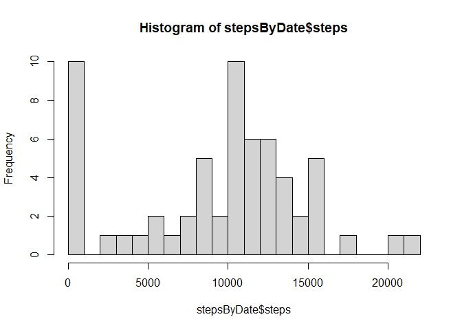
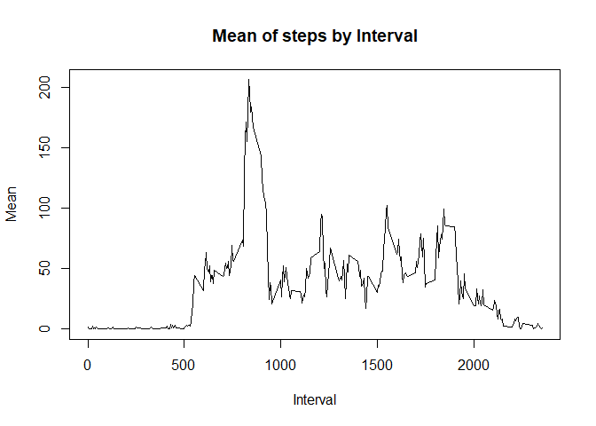
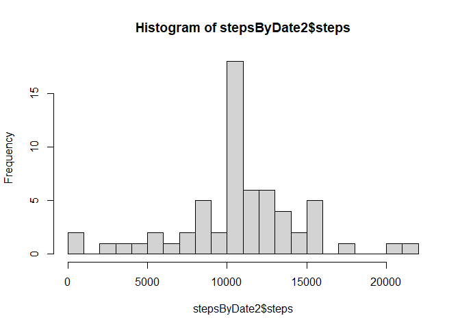
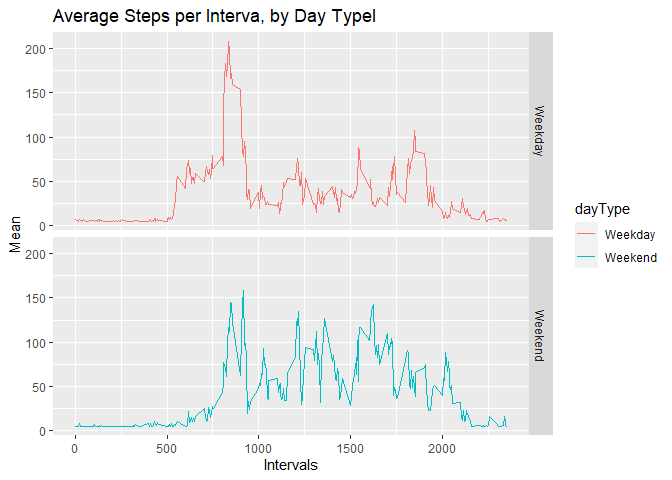

Loading and preprocessing the data

```r
activity <- read.csv("repdata_data_activity/activity.csv")
activity$date <-  as.Date(activity$date)
```
Histogram of the total number of steps taken each day

```r
stepsByDate <- aggregate(activity$steps, by = list(activity$date), FUN=sum, na.rm = TRUE)
colnames(stepsByDate)<- c("date", "steps")
hist(stepsByDate$steps, breaks = 30)
```

<!-- -->
Mean and Median

```r
mSteps <- mean(stepsByDate$steps)
mdSteps <- median(stepsByDate$steps)
print(c("mean = ", mSteps , "median = ", mdSteps))
```

```
## [1] "mean = "          "9354.22950819672" "median = "        "10395"
```
Average daily activity pattern

```r
intervalSteps <- aggregate(activity$steps, by = list(activity$interval), FUN=mean, na.rm = TRUE)
colnames(intervalSteps)<- c("Interval", "Mean")
plot(intervalSteps$Mean ~ intervalSteps$Interval,
     type="l", xlab = "Interval", ylab = "Mean",
     main = "Mean of steps by Interval")
```

<!-- -->
Imputing missing values

```r
library(Hmisc)
```

```
## Warning: package 'Hmisc' was built under R version 4.1.2
```

```
## Loading required package: lattice
```

```
## Loading required package: survival
```

```
## Loading required package: Formula
```

```
## Loading required package: ggplot2
```

```
## Warning: package 'ggplot2' was built under R version 4.1.2
```

```
## 
## Attaching package: 'Hmisc'
```

```
## The following objects are masked from 'package:base':
## 
##     format.pval, units
```

```r
isna <- is.na(activity$steps)
print(c( "Total NAs = ", table(isna)))
```

```
##                         FALSE           TRUE 
## "Total NAs = "        "15264"         "2304"
```

```r
cleanData <- activity
cleanData$steps <- impute(activity$steps, fun=mean)
```
New histogram after missing values imputed

```r
stepsByDate2 <- aggregate(cleanData$steps, by = list(cleanData$date), FUN=sum, na.rm = TRUE)
colnames(stepsByDate2)<- c("date", "steps")
hist(stepsByDate2$steps, breaks = 30)
```

<!-- -->
New Mean and Median

```r
mSteps2 <- mean(stepsByDate2$steps)
mdSteps2 <- median(stepsByDate2$steps)
print(c("mean = ", mSteps2 , "median = ", mdSteps2))
```

```
## [1] "mean = "          "10766.1886792453" "median = "        "10766.1886792453"
```
Weekdays vs Weekends

```r
library(dplyr)
```

```
## 
## Attaching package: 'dplyr'
```

```
## The following objects are masked from 'package:Hmisc':
## 
##     src, summarize
```

```
## The following objects are masked from 'package:stats':
## 
##     filter, lag
```

```
## The following objects are masked from 'package:base':
## 
##     intersect, setdiff, setequal, union
```

```r
cleanData2 <- mutate(cleanData, weekday = weekdays(cleanData$date))
cleanData2$dayType <- ifelse(cleanData2$weekday =="Saturday" | cleanData2$weekday =="Sunday", "Weekend", "Weekday" )
cleanData2$dayType <- as.factor(cleanData2$dayType)
```
Weekdays vs Weekends plot

```r
library(ggplot2)
cleanData3 <- aggregate(cleanData2$steps , by= list(cleanData2$dayType, cleanData2$interval),  FUN=mean)
colnames(cleanData3) <- c("dayType", "interval", "steps")
ggplot(cleanData3, aes(x=interval, y=steps, color=dayType))+ 
  geom_line()+
  facet_grid(dayType ~.)+ 
  xlab("Intervals") + ylab("Mean")+
  ggtitle("Average Steps per Interva, by Day Typel")
```

<!-- -->
